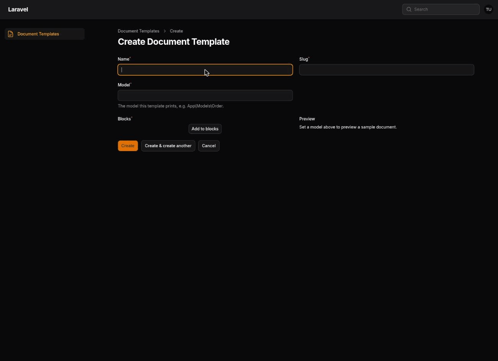

# Document Studio

[](https://github.com/TommasoMusetti/filament-doc-studio/actions?query=workflow%3Atests+branch%3Amain)
[](LICENSE.md)

A PDF template builder for end users, inside Filament. Your client drags blocks
into a template and prints a record as a PDF — without a developer touching a
Blade file for every "can you change the quote layout?".



> **Work in progress.** The v1 scope (3 blocks, merge fields, a live preview,
> dompdf) is built end to end. Polish and packaging are what's left before
> the first tagged release.

## Status

| | |
|---|---|
| Editor | Filament Builder field, inside your panel |
| Blocks | heading, paragraph (with merge fields), table (line items) |
| Merge fields | yes — a whitelist you declare per model |
| Preview | live, next to the editor, rendered against a sample record |
| Engine | dompdf (pure PHP, nothing to install on the server) |

## Installation

```bash
composer require tommasomusetti/filament-doc-studio
php artisan doc-studio:install
```

The install command publishes the migration and offers to run it. By hand:

```bash
php artisan vendor:publish --tag="doc-studio-migrations"
php artisan migrate
```

Then add the plugin to the panel that should get the editor:

```php
use TommasoMusetti\DocStudio\DocStudioPlugin;

public function panel(Panel $panel): Panel
{
    return $panel
        // ...
        ->plugins([
            DocStudioPlugin::make(),
        ]);
}
```

Templates now live under **Document templates** in that panel.

## Rendering a PDF

```php
use TommasoMusetti\DocStudio\DocumentRenderer;
use TommasoMusetti\DocStudio\Models\DocumentTemplate;

$template = DocumentTemplate::where('slug', 'quote')->firstOrFail();

$pdf = app(DocumentRenderer::class)->pdf($template); // raw PDF bytes
```

The renderer never touches Filament, so this works from a queued job or a
console command as well as from a panel.

## Whitelisting merge fields and line item tables

The paragraph and table blocks pull data from a model, but only through a
`DocumentDataSource` you write — a template can never reach an Eloquent
attribute you didn't explicitly expose:

```php
use TommasoMusetti\DocStudio\Contracts\DocumentDataSource;

class OrderDataSource implements DocumentDataSource
{
    public static function model(): string
    {
        return Order::class;
    }

    public function fields(): array
    {
        return [
            'customer_name' => [
                'label' => 'Customer name',
                'resolver' => fn (Order $order): string => $order->customer->name,
            ],
        ];
    }

    public function collections(): array
    {
        return [
            'line_items' => [
                'label' => 'Line items',
                'columns' => ['name' => 'Item', 'qty' => 'Qty'],
                'resolver' => fn (Order $order): iterable => $order->lines
                    ->map(fn ($line) => ['name' => $line->name, 'qty' => $line->qty]),
            ],
        ];
    }

    public function sample(): Order
    {
        // The record the live preview renders against while editing.
        return Order::query()->latest()->first() ?? new Order(['id' => 0]);
    }
}
```

Register it once, in a service provider's `boot()`:

```php
app(DocumentRenderer::class)->registerDataSource(OrderDataSource::class);
```

The paragraph block's merge tag picker and the table block's collection
picker both read this whitelist — a field or column disappears from the
editor the moment you stop declaring it, without touching saved templates.

## Restricting the blocks a panel offers

```php
DocStudioPlugin::make()->blocks([
    HeadingBlock::class,
]);
```

A panel can only narrow the list. It cannot offer a block the renderer does not
know: disabling a block must never break templates already saved with it.

## Adding your own block

A block is one class with two faces — an editor field set, and print HTML:

```php
use Filament\Forms\Components\Builder\Block;
use Filament\Forms\Components\TextInput;
use TommasoMusetti\DocStudio\Blocks\DocumentBlock;
use TommasoMusetti\DocStudio\RenderContext;

class StampBlock extends DocumentBlock
{
    public static function make(): Block
    {
        return Block::make('stamp')->schema([
            TextInput::make('text')->required(),
        ]);
    }

    public function render(array $data, RenderContext $context): string
    {
        return '<p class="stamp">' . e($data['text'] ?? '') . '</p>';
    }
}
```

Register it with the renderer, in a service provider's `boot()`:

```php
app(DocumentRenderer::class)->register(StampBlock::class);
```

Write the HTML dompdf first: table layouts, conservative CSS, no flexbox or
grid. And escape anything the user typed — a template is user written content.

## Local development

`workbench/` is a small Laravel app with a real Filament panel, so the plugin
can be opened in a browser:

```bash
composer serve   # http://127.0.0.1:8000/admin
```

Log in with `test@example.com` / `password`. The same panel is registered in the
test suite, so the panel tests run against what you see in the browser.

```bash
composer test
composer analyse
composer lint
```

## Contributing

Please see [CONTRIBUTING](.github/CONTRIBUTING.md).

## Security

Please review [our security policy](.github/SECURITY.md) on how to report security
vulnerabilities.

## Credits

- [Tommaso Musetti](https://github.com/TommasoMusetti)

## License

The MIT License (MIT). Please see [License File](LICENSE.md) for more information.
